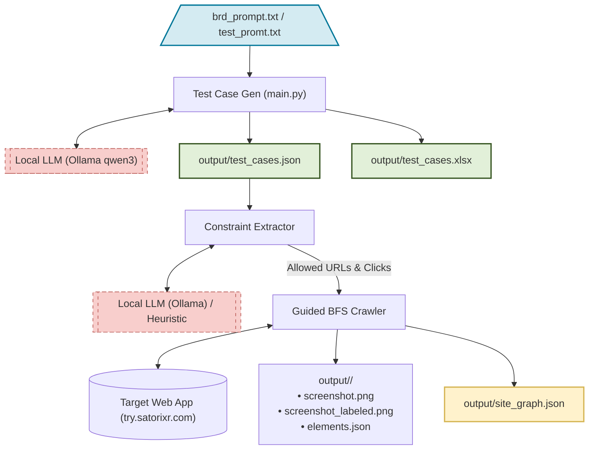

# SatoriXR AI-Powered QA Test Case Generation & Guided Crawler Pipeline

An end-to-end automated visual testing and analysis pipeline that bridges the gap between requirements and visual verification. The pipeline leverages local Large Language Models (LLMs) via Ollama to generate exhaustive QA test suites directly from specifications, extracts path/click constraints, and guides a visual web crawler to build page-state relationship graphs focusing solely on test case flows.



---

## Directory Structure

```text
├── .auth/                  # Standardized authentication state storage
│   └── state.json          # Reusable browser cookies & localStorage state
├── Crawler/                # Guided visual crawler module
│   ├── login/              # Automation scripting for session acquisition
│   │   ├── fetchOTP.py     # IMAP inbox fetcher for Gmail OTP retrieval
│   │   └── login.py        # Playwright login script automating inputs & submission
│   ├── constants/
│   │   └── prompts.py      # LLM constraints prompt & DOM extraction script (EXTRACTION_JS)
│   ├── utils/
│   │   └── helpers.py      # Matching logic, overlay drawing, and path formatting helpers
│   ├── constraint_extractor.py # Extract allowed clicks & paths from generated test cases
│   ├── crawl_graph.py      # Crawler entry point establishing BFS queue & launching workers
│   ├── hooks.py            # Playwright before/after navigation hooks & API capturing
│   ├── login_manager.py    # Lock-based login state validator & initiator
│   ├── process_worker.py   # Async BFS workers managing CrawlerRunConfig page evaluations
│   └── README.md           # Visual Crawler sub-module documentation
├── Test_Case_Gen/          # Requirements extraction and test generation module
│   ├── constants/
│   │   └── prompts.py      # System/User prompt templates for test generation
│   ├── utils/
│   │   └── helpers.py      # JSON normalization and Excel formatting exporters
│   ├── generator.py        # Ollama API request wrapper & orchestrator
│   ├── main.py             # CLI parser and generation pipeline driver
│   ├── brd_prompt.txt      # Default business specification document
│   ├── test_promt.txt      # Expanded business specification document with Settings
│   └── README.md           # Test Case Generator sub-module documentation
├── shared_utils/           # Shared utility modules
│   ├── __init__.py
│   └── logger.py           # Unified Daily rolling logger configuring Stream + File handlers
├── output/                 # Pipeline JSON results, HTML summaries, and screenshots
├── requirements.txt        # Python package dependencies
├── run_pipeline.sh         # Linux/Unix pipeline execution shell script
├── run_pipeline.bat        # Windows CMD pipeline batch script
└── README.md               # Pipeline root documentation
```

---

## Setup Instructions

### 1. Local LLM Setup

The pipeline relies on [Ollama](https://ollama.com/) running locally.

1. Download and install Ollama from [Ollama's official website](https://ollama.com/).
2. Start the Ollama server.
3. Pull the required models (e.g. `qwen3:8b` or `qwen3-coder:latest`):

   ```bash
   ollama pull qwen3-coder:latest
   ```

### 2. Environment Setup

Create a `.env` file at the root of your project using the structure below:

```env
# Ollama Settings
OLLAMA_MODEL=qwen3-coder:latest
OLLAMA_URL=http://localhost:11434

# Output Directory
OUTPUT_DIR=./output

# Credentials (used to login and bypass OTP gates automatically)
EMAIL_ADDRESS=sarvesh@satorixr.com
EMAIL_PASSWORD=pqne vggg cfon plmv
```

### 3. Dependencies

Setup a Python virtual environment and install the required libraries:

- **Windows (CMD):**

  ```cmd
  python -m venv venv
  call venv\Scripts\activate.bat
  pip install -r requirements.txt
  playwright install chromium
  ```

- **Linux / macOS:**

  ```bash
  python3 -m venv venv
  source venv/bin/activate
  pip install -r requirements.txt
  playwright install chromium
  ```

---

## Running the Pipeline

You can run the end-to-end pipeline sequentially (Test Case Generation followed by guided Crawling) using the provided shell scripts:

### Windows (CMD)

Run the batch file [run_pipeline.bat]:

```cmd
run_pipeline.bat
```

*Note: This script targets [Test_Case_Gen/test_promt.txt] containing Settings pages specs.*

### Linux / macOS

Run the shell script [run_pipeline.sh]:

```bash
chmod +x run_pipeline.sh
./run_pipeline.sh
```

*Note: This script targets [Test_Case_Gen/brd_prompt.txt].*

---

## Outputs Breakdown

All outputs are saved to the `./output/` directory:

1. **Test Cases**:
   - `output/test_cases.json`: The raw generated test suite structured in a clean JSON format.
   - `output/test_cases.xlsx`: A professionally formatted spreadsheet. Columns are wrapped and dynamically resized based on content length. Preconditions, steps, and requirements are structured in multi-line blocks inside cells for readability.

2. **Transition Graph**:
   - `output/site_graph.json`: Contains the complete page-state transition representation.
     - `pages`: List of states with fields `url`, `folder`, `title`, `element_count`, and `apis` (network calls made during load).
     - `links`: List of transitions mapping how states connect with details on the click target `text`, HTML `element_id`, `locator`, and `apis` triggered during the state transition.

3. **Visual Pages & Screenshots**:
   - For every distinct page state, a folder named after the URL route is created under `output/` (e.g. `output/root`, `output/product_create_state_4`). Inside each folder:
     - `screenshot.png`: Clean screenshot of the browser view.
     - `screenshot_labeled.png`: Screenshot overlay containing red bounding boxes and numeric ID badges for all interactive elements.
     - `elements.json`: Comprehensive array of extracted elements containing their selector path, Playwright locator strategy, bounding box coordinates, and aria states.
     - `page_info.json`: Metadata tracking title, timestamp, exact URL, and initial API logs.

---

## Technical Details

- **Signatures and Deduplication**: The crawler avoids infinite loops and identical pages (e.g. dynamic settings modals showing visual elements but keeping the base URL) by hashing page signatures (using tags, locators, and text). If a page has a match, its screenshots are deleted, and its transition path is redirected to the existing page object.
- **Unified Login Protocol**: If [state.json] is missing, the script initiates a headed browser script. It automatically inputs the user credentials, queries the Google Gmail inbox via IMAP to capture the latest "TRY Login Code" OTP, submits it, saves browser cookies, and closes. Subsequent workers load this state.json in headless mode.
- **Word-Boundary Constraint Matches**: The constraints extractor maps test case steps to regex expressions using `\b` word boundaries (e.g., matching a button label `View` won't match `Preview` by accident), pruning links and clicks that are unrelated to the current test suite.
# ai_framework_using_crawler
